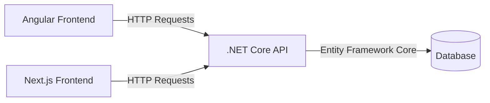
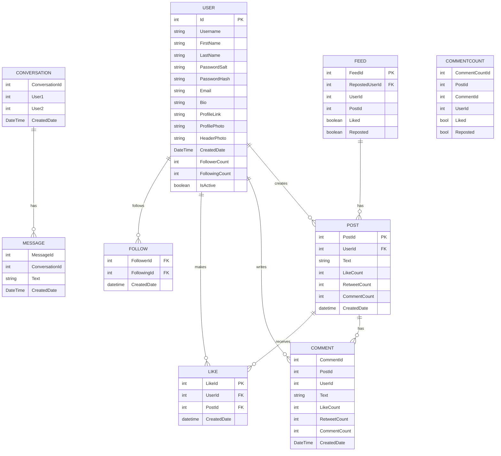

# Social Network Project

* This is a social network project with a .NET Core backend and Angular + Next.js frontends. It was created to practice and demonstrate my skills with these technologies.

* AI is used to help troubleshoot problems and speed up the development process, but the code is primarily written, reviewed, and tested by me. SOLID principles and other clean code practices are followed throughout the project.

* Both frontends provide exactly the same functionality. Users can choose whichever frontend they prefer.

# Usage
* After running the API project, update the localhost address in the frontend you want to use.
* The password for all sample users is `123456`. The following usernames can be used to log in: `ethanbennett`, `ameliaross`, `benjaminsullivan`, `oliviafoster`, and `henryanderson`.

# Database
* Database tables are shown below.

